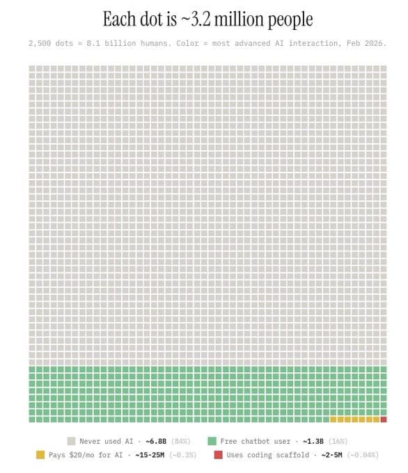

.jpg)
<small>Michelangelo, The Creation of Adam — Sistine Chapel, 1512</small>

I don't remember where I first picked this up. But the idea stuck.

The Renaissance happened because knowledge became accessible. Before Gutenberg's press, knowledge lived in monasteries and courts. To learn, you needed proximity to the people who already knew. That made specialization not a choice but a constraint: you learned what was available near you.

The press changed the equation. Books traveled. Knowledge crossed geography and discipline. And suddenly you had people like Da Vinci: painter, engineer, anatomist, architect. Michelangelo: sculptor, poet, architect. People who moved across disciplines not because they were uniquely gifted, but because the knowledge to do so was available to them for the first time.

The generalist was not rare in the Renaissance. The generalist was the *product* of the Renaissance.

---

Then we industrialized, and the factory model won, not just for manufacturing, but for education.

Schools started producing specialists by design. Universities divided into faculties. Careers narrowed into tracks. The logic made sense: complex systems needed deep experts. You could not afford a hospital where doctors also designed the building.

But the cost was invisible. We stopped producing people who could see across things. We started calling the ability to connect disciplines "creativity" and treating it like a personality trait, something you either had or didn't, rather than what it actually is: a skill that knowledge access enables. Ken Robinson made this case in [Do Schools Kill Creativity?](https://brain.imsulaeman.me/note/sources/do-schools-kill-creativity): the education system didn't select against creative people, it produced uncreative ones.

The Renaissance generalist did not disappear because humans changed. They disappeared because the system stopped creating the conditions for them.

---

I am not a developer.

I study information systems at Binus. I cannot write a product yet. But in the last 3 months I built Rutin: a full Android health app with alarm-grade medicine reminders, a sleep detection foreground service written in Kotlin, a morning gate you cannot skip, and wake-up games that run before your phone becomes usable.

I built it because I have tuberculosis. A missed dose can cause drug resistance. I needed something that worked and nothing existing did. As I wrote about [last month](/writings/on-building-tools-you-wish-existed), the best tools start from personal frustration.

A few years ago, building that would have required a team. A Flutter developer. A Kotlin developer for the native Android services. A UX designer. A product manager. The knowledge lived in separate silos. You needed a specialist in each one.

I did not become a developer. I learned to [direct across those silos](https://brain.imsulaeman.me/note/concepts/skills-abstracting-upward) instead. The AI tools handle the translation between what I understand and what the code needs to be. I stay focused on the problem. The craft follows.

That is the Renaissance condition: knowledge accessible enough that one person can span what used to require many.

---

<small>Source: [Insanely Cool Tools](https://insanelycooltools.substack.com/p/insanely-cool-tools-substack-edition-edc)</small>

Each dot is 3.2 million people. The whole image is 8.1 billion humans.

The red sliver — the people paying for AI tools, reading about it, arguing about it — is roughly 0.06% of that. It feels crowded because everyone in your feed is inside that sliver.

The other 99.94% have not started yet.

---

The first Renaissance took decades to propagate. The printing press was invented in the 1440s. The full flowering came a generation later, as the books spread and people learned what to do with them.

We are in the 1440s right now.

The press exists. Most people have not yet learned to read with it. The only real question is who's practicing now, while the world is still catching up.
